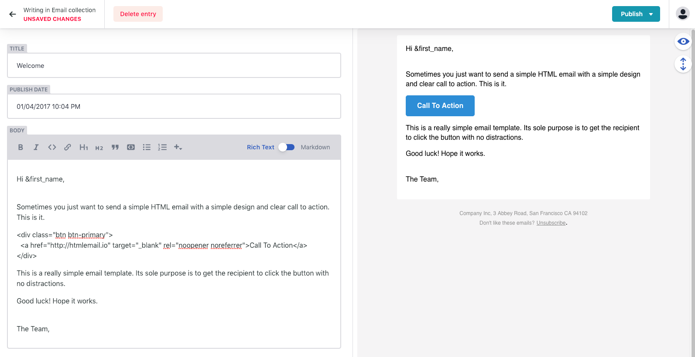

# Dynamic email template

This repo was forked from, [Gatsby-starter-netlify-cms](https://github.com/netlify-templates/gatsby-starter-netlify-cms). The email styling was powered by [Responsive-html-email-template](https://github.com/leemunroe/responsive-html-email-template).



## What we want to archie from this project

- We want to cover multi-languages template. The number of template can reach to hundreads.
- Allow editors can compose their email by WYSIWYG edit tool, so devs can freely to handle another stuffs.
- These email are programable, we can intergrate some tools (like PhraseApp) to manipulate content automatically.

## The todo list

[] Remove some script inside the html files  
[] Create `gatsby-email-template` as a gatsby plugin, inline the CSS properties into the style attribute in an html file. Some API services (like Mailgun) you need to inline the CSS before sending.  
[] Using real path to imgs when sending email, instead of related path.  
[] What happend when we would like to add a button, like `view this email in browser`?

## Getting Started (Recommended)

Netlify CMS can run in any frontend web environment, but the quickest way to try it out is by running it on a pre-configured starter site with Netlify. The example here is the Kaldi coffee company template (adapted from [One Click Hugo CMS](https://github.com/netlify-templates/one-click-hugo-cms)). Use the button below to build and deploy your own copy of the repository:

<a href="https://app.netlify.com/start/deploy?repository=https://github.com/tampham47/dynamic-email-template&amp;stack=cms"></a>

After clicking that button, you’ll authenticate with GitHub and choose a repository name. Netlify will then automatically create a repository in your GitHub account with a copy of the files from the template. Next, it will build and deploy the new site on Netlify, bringing you to the site dashboard when the build is complete. Next, you’ll need to set up Netlify’s Identity service to authorize users to log in to the CMS.

### Access Locally
```
$ git clone https://github.com/[GITHUB_USERNAME]/[REPO_NAME].git
$ cd [REPO_NAME]
$ yarn
$ npm run develop
```
To test the CMS locally, you'll need run a production build of the site:
```
$ npm run build
$ npm run serve
```

## Getting Started (Without Netlify)
```
$ gatsby new [SITE_DIRECTORY_NAME] https://github.com/netlify-templates/gatsby-starter-netlify-cms/
$ cd [SITE_DIRECTORY_NAME]
$ npm run build
$ npm run serve
```

### Setting up the CMS
Follow the [Netlify CMS Quick Start Guide](https://www.netlifycms.org/docs/quick-start/#authentication) to set up authentication, and hosting.

## Debugging
Windows users might encounter ```node-gyp``` errors when trying to npm install.
To resolve, make sure that you have both Python 2.7 and the Visual C++ build environment installed.
```
npm config set python python2.7
npm install --global --production windows-build-tools
```

[Full details here](https://www.npmjs.com/package/node-gyp 'NPM node-gyp page')

## Purgecss
This plugin uses [gatsby-plugin-purgecss](https://www.gatsbyjs.org/packages/gatsby-plugin-purgecss/) and [bulma](https://bulma.io/). The bulma builds are usually ~170K but reduced 90% by purgecss.
